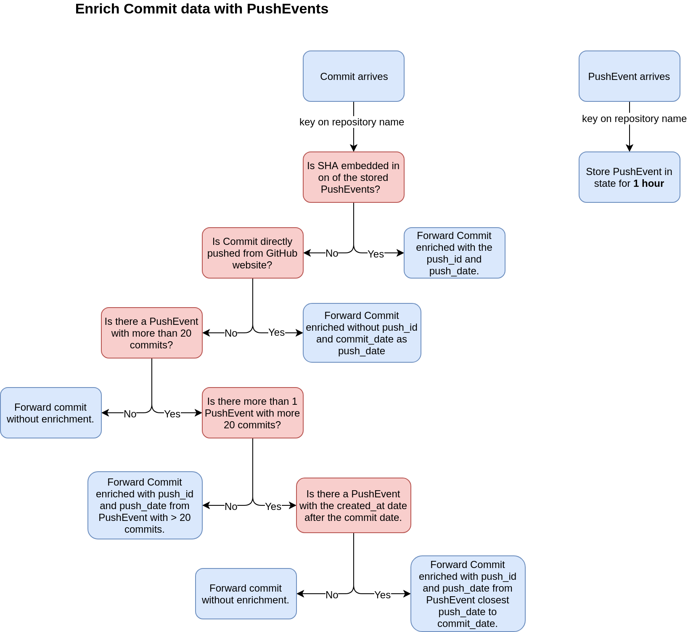

# GHTorrent Mirror plugin
The goal of this plugin is to mirror GHTorrent. 

## Architecture

## Experimental

### 📊 Hourly commit stats
This stage reduces all commits to a stats object keyed on their commit date (hourly).
The stats object looks like this:
```scala
  case class Stats(date: String, commitStats: CommitStats)

  case class CommitStats(totalCommits: Long, filesEdited: List[Extension])

  case class Extension(name: String,
                       additions: Long,
                       deletions: Long,
                       added: Long,
                       removed: Long,
                       modified: Long)
```

In summary, every commit is keyed by date (e.g. `2019-01-01 09`) and then its stats are deduced and merged. Finally these stats are saved (and updated) in MongoDB.

### 💗Commit enrichment
The idea of this stage is to enrich Commit data with their corresponding PushEvent (if available). I.e. Add the `push_id` and `push_date` to a Commit.

The commit is enriched in the following case class:
```scala
  case class Pushed(push_id: Long,
                    push_date: Date,
                    pushed_from_github: Boolean = false)

  case class EnrichedCommit(push: Option[Pushed], commit: Commit)
```
All data is pushed into the `cf_commit` topic.


The flow diagram of this low-level join can be found below:


The potential outcomes are:
- PushEvent can be found and Commit is enriched with `push_id` and `push_date`.
- PushEvent can not be found but it is derived that Commit is directly pushed from GH. The Commit is then enriched with no `push_id` and the `push_date == commit_date`.
- No PushEvent can be found and Commit is just forwarded without `Pushed` data.